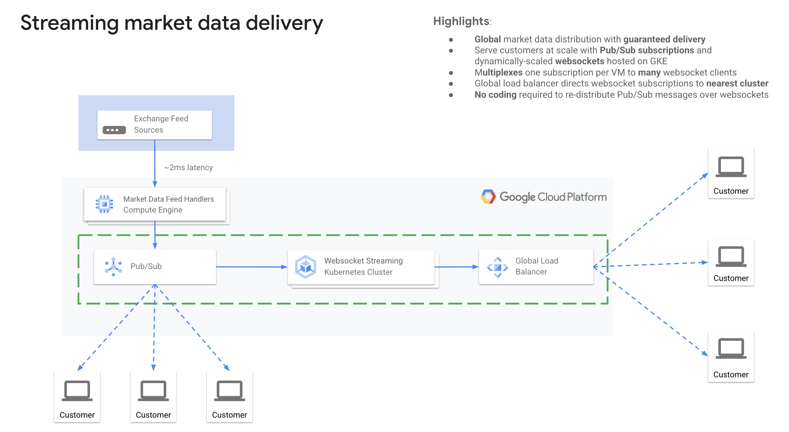
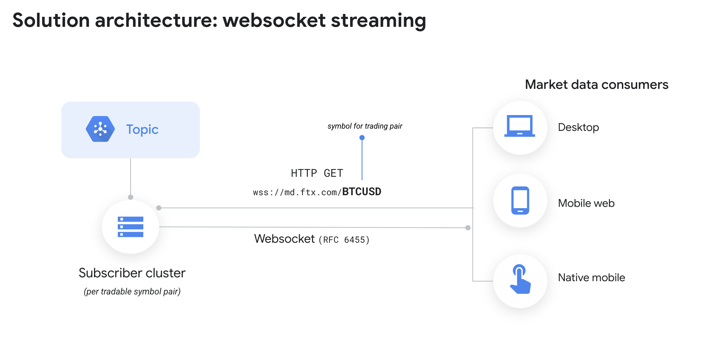

  

# `gke-pubsub-websocket-adapter`

  

The `gke-pubsub-websocket-adapter` provides an easy way to distribute [Google Cloud Pub/Sub](https://cloud.google.com/pubsub) topic messages over [WebSockets](https://en.wikipedia.org/wiki/WebSocket) so that they may be sent to web clients without using the `gcloud` SDK or Pub/Sub API.

  

## Requirements

  

To deploy `gke-pubsub-websocket-adapter` to your GCP project, you will need billing enabled

and the following permissions:

  

* Read access to the topic you'd like to mirror. The topic may reside

in a separate project provided that it is readable by the user or service account

`gke-pubsub-websocket-adapter` runs as.

* Pub/Sub subscripton creation privileges in your own project

* A GKE cluster

* A front-end load balancer

  

## Architecture

The `gke-pubsub-websocket-adapter` clusters are stateless and doesn't require persistent disks for the VMs in the cluster. A memory-mapped filesystem is specified within the image that is used for ephemeral POSIX-storage of the Pub/Sub opic messages. Storing a buffer of these messages locally has a few advantages:

* It decouples the subscription from client WebSocket connections, and multiplexes potentially many clients while only consuming a single subscription per VM.
* By using `tail -f` as the command piped to [`websocketd`](http://websocketd.com/), clients are served a cache of the last 10 messages published to the topic, even when there is no immediate message flow. This allows for UIs rendering message content to show meaningful data even during periods of low traffic.
  

The `gke-pubsub-websocket-adapter` exposed to web clients through a single endpoint that maps to an indivdual Pub/Sub topic and load balances across VMs in the cluster. The cluster is set to scale up and down automatically based upon the number of clients connected.

Currently, the `gke-pubsub-websocket-adapter` uses WebSockets in half-duplex and does not support the publishing of messages by clients over the same WebSocket connection.

  

## 

  

The `gke-pubsub-websocket-adapter`'s architecture consists of a number of underlying components that work in concert to distribute Pub/Sub messages over WebSockets. These include:

  
### Runtime

  

*  [`websocketd`](http://websocketd.com/) CLI for serving websocket clients
*  [`pulltop`](https://github.com/GoogleCloudPlatform/pulltop) CLI for Pub/Sub subscription management
*  [GKE](https://cloud.google.com/kubernetes-engine)


### Authentication

The `gke-pubsub-websocket-adapter` uses [Workload Identity](https://cloud.google.com/kubernetes-engine/docs/how-to/workload-identity) to authenticate with Pub/Sub under the Google service account called `dyson-sa`. If you are wanting to use a private Pub/Sub topic this service account will require access to the topic.

## Configuration

  
[kpt](https://googlecontainertools.github.io/kpt/) is used for setting config for the Kubernetes manifests.

You can see the variables that can be set by running `kpt cfg list-setters .` from within the directory.

For the default deploy, these variables are set for you in the `cloudbuild.yaml` file. If you would like to pass through a different topic for the example you can so by passing [substitution variables](https://cloud.google.com/cloud-build/docs/configuring-builds/substitute-variable-values) into Cloudbuild.

  
`gcloud builds submit --config cloudbuild.yaml --substitutions=_DYSON_APP_NAME="demo-app",_DYSON_TOPIC="projects/sample/topic"`


## How it works

For each PubSub topic, an accompanying websocket service will be created and exposed.  The [websocket-to-pubsub-ingest](https://github.com/fayezinislam/websocket-to-pubsub-ingest) project published the messages from the original websocket feed to the pubsub topics in order to scale out the messages.  This project will take those messages on the individual topics and make them available through individual websocket streams.   






## Deployment


### 1) Prerequisistes

 * Install gcloud
 * Install terraform

### 2) Create Cluster
  
Run the following command to create the GKE cluster and build the docker image.  This script will trigger the Cloud Build tool to run the build for the [cloudbuild.yaml](cloudbuild.yaml) file.

```
./deploy.sh
```

 * Confirm that the cluster has been created.  
 * Confirm that a static IP with the name `ftx-gcpfsi-ip` was created

### 3) Generate configuration and config for market pairs

Run the following command.  This will connect to the websocket to get the market pair list, and then generate configuration and config for the market pairs.  There is a large list of market pairs, and the list can change.  This will retrieve the current list and generate configuration for it.  The configuration will be used for the next section.

 * PROJECT_NAME - service account to use
 * ZONE - zone to deploy the kubernetes cluster to
 * CLUSTER_NAME - name of kubernetes cluster
 * WS_URL - websocket url (wss://domain/path)
 * TOPIC_PREFIX - full prefix for topic names ("projects/$PROJECT_NAME/topics/prefix_")
 * MKT_PAIR_LIST_LIMIT - Gets first n pairs from the list.  Or use -1 for all
 * DEBUG - output extra debug messages (true/false)

```
export PROJECT_NAME=xxxx
export ZONE=us-central1-a
export CLUSTER_NAME=ftx-com-mktpair-cluster
export WS_URL=wss://domain.com
export TOPIC_PREFIX=projects/$PROJECT_NAME/topics/prefix_
export MKT_PAIR_LIST_LIMIT=25
export DEBUG=true

npm install

node ./generateCBfiles.js $PROJECT_NAME $ZONE $CLUSTER_NAME $WS_URL $TOPIC_PREFIX $MKT_PAIR_LIST_LIMIT $DEBUG
```

This program will generate the following.
 * Cloudbuild YAML file - Generated for each market pair in the "cloudbuild_mktpairs/" folder.  The YAML file contains settings for that market pair, setting the YAML values using kpt in the kubernetes_mktpair folder.  The files in the kubernetes_mktpair folder are for creating the resources in kubernetes, but the YAML files in cloudbuild_mktpairs set the parameters for each market pair.
 * cbCalls.cfg - creates config that can be used in the cloudbuild.yaml - these commands will create the kubernetes pod for the market pair.  However, cloudbuild has a limit of 100 steps, which means if you have more than 100 market pairs, this approach won't work
 * cbCommands.sh - creates a script that calls a list of commands that will deploy the market pair pods.  
 * ingress.yaml - creates the ingress config and paths

To change what the program is generating, look at the outputCBCalls, outputCBBuilds and outputIngressPaths functions.


### 4) Create pods and services with cloud build

Now that the configuration and scripts have been generated for the marketpairs, run the script to deploy the pods per marketpair and channel.  The generated YAML files were saved in the `cloudbuild_mktpairs` folder along with the script to deploy them.  Run the script to deploy the pods to the kubernetes cluster

```
ls -l ./cloudbuild_mktpairs
mv ./cloudbuild_mktpairs/cbCommands.sh ./
chmod +x ./cbCommands.sh
./cbCommands.sh
```

This script will take a while to run, especially if there are a lot of market pairs.  When completed, confirm all pods and services have been deployed and are running, either through the console or command line

```
kubectl get pods
kubectl get services
```

To test, you can set up a port forward to the service and use the listen.js program to connect.  By default, the service is not available outside of the cluster.  

```
kubectl port-forward service/$SERVICE_NAME 8080:80

# new ssh session
node listen.js 0.0.0.0:8080
```


### 5) Create ingress

All of the pods and services have been created, however, they are not publicly accessible.  Create an ingress to allow the endpoints to be accesible through a domain name and path.  The program in step 3 generated the ingress.yaml.  Deploy that file to create the ingress with the path names

```
ls -l ./cloudbuild_mktpairs
mv ./cloudbuild_mktpairs/ingress.yaml ./
kubectl apply -f ./cloudbuild_mktpairs/ingress.yaml
kubectl get pods
```

This will take a while to run, but it's creating an ingress with all of its properties and paths configured.  After it is created, verify either through the console or command line.


### 6) Configure DNS and certificates

 * Create a managed cert with the name `ftx-gcpfsi-com-cert`
 * Configure the DNS entry of the domain name to point to the ingress IP

 Since the sample leverage's TLS, you will need to point an A record to the address created as apart of the terraform script. You can get the address by running the following.

`gcloud compute addresses describe ftx-gcpfsi-ip --global --format="value(address)"`

Once you have updated the A record to point to this address, it can take up to 20 minutes for the cert to be issued.

To understand the status of the certificate you can run the following: 

`gcloud compute ssl-certificates list `

 
### 7) Test configuration and websocket

Test the websocket using the domain and the path that is described in the ingress.yaml.

`node listen.js $DOMAIN_NAME/$PATH`

Open a web browser and visit `$DOMAIN_NAME/$PATH`.  This will display a websocket test UI.  Change the path to change the websocket target.  

 

## Known issues and enhancements

  

* If you visit the cluster on the HTTP port instead of the WS/S port, you will be presented with the `websocketd` diagnostic page. Clicking on the checkbox will allow you to see the Pub/Sub messages coming through the WebSocket in the browser. This can be disabled by removing the `--devconsole` argument from the `websocketd` call in the [container setup's](https://github.com/GoogleCloudPlatform/gke-pubsub-websocket-adapter/blob/main/container/exec.sh) `exec.sh` file.

* If you would like to secure your websockets with TLS to support _wss_ (_WebSocket_ Secure) you can follow [this documentation](https://cloud.google.com/kubernetes-engine/docs/how-to/managed-certs) or if you would like to leverage Google-managed certificates you can use the following [documentation](https://cloud.google.com/kubernetes-engine/docs/how-to/managed-certs).

  

## See also

  

## Disclaimers

  

_This is not an officially supported Google product._

  
The `gke-pubsub-websocket-adapter` is under active development. Interfaces and functionality may change at any time.

  

## License


This repository is licensed under the Apache 2 license (see [LICENSE](LICENSE.txt)).

Contributions are welcome. See [CONTRIBUTING](CONTRIBUTING.md) for more information.